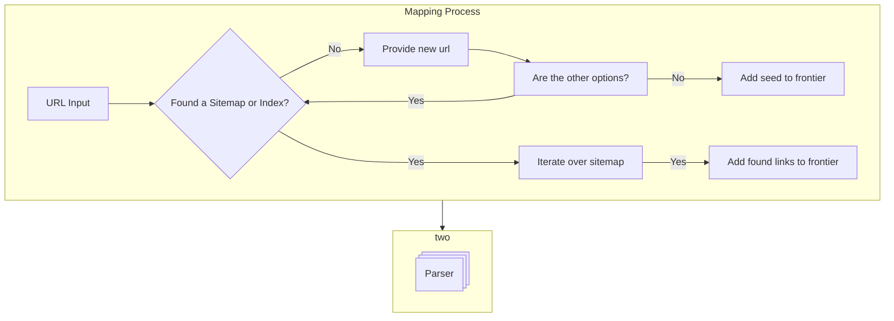

### Events
| Source     |          Trigger          |             Data              |   Status After   |            Tracker Action             |
| :--------- | :-----------------------: | :---------------------------: | :--------------: | :-----------------------------------: |
| Mapper     | On non-sitemap link found |              URL              |     Started      |              Collect URL              |
| Mapper     |        On success         | sitemap_indexes, sitemap_urls |     Mapped       | Request downloads for each found link |
| Mapper     |        On failure         |      any partial results      |   Map Skipped    |       Add seed_url to frontier        |
| Downloader |        On success         |     status_code, content      |    Downloaded    |         request page parsing          |
| Downloader |       On forbidden        | status_code, robots.txt info  |    Forbidden     |  Close URL, add to dead letter queue  |
| Downloader |        On failure         |          status_code          | Downloader Error |     Close URL, add to retry queue     |
| Parser     |         On start          |                               |      Parsed      |        Add to do not parse set        |
| Parser     |       On link found       |              URL              |     Started      |               Init URL                |
| Parser     |        On success         |     Scraped data (links)      |    Completed     |               Init URL                |
| Parser     |        On failure         |         Parser Error          |     Started      |       Add to dead letter queue        |

